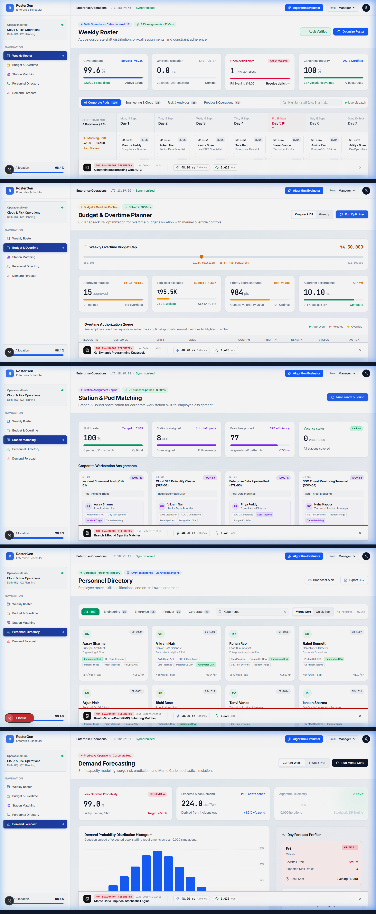

<div align="center">

# ⚡ RosterGen

### Enterprise Workforce Scheduling & Algorithm Evaluation Platform

> **A workforce scheduling system that turns classical Analysis of Algorithms (AOA) into an observable, production-grade enterprise application.**

[](https://nextjs.org/)
[](https://react.dev/)
[](https://www.typescriptlang.org/)
[](https://tailwindcss.com/)
[](https://github.com/pmndrs/zustand)
[](https://supabase.com/)

<br />

[📖 Architecture](#7-system-architecture) • [🧠 Algorithm Suite](#5-algorithm-suite) • [📊 Complexity Table](#10-algorithm-complexity) • [⚡ Evaluator Telemetry](#11-evaluator--telemetry) • [📸 Screenshots](#12-screenshots) • [🚀 Quickstart](#14-installation)

---



</div>

---

## 📋 Table of Contents

1. [Overview](#1-overview)
2. [Problem Statement](#2-problem-statement)
3. [Objectives](#3-objectives)
4. [Core Features](#4-core-features)
5. [Algorithm Suite](#5-algorithm-suite)
   - [5.1 Backtracking & AC-3 Arc Consistency](#51-backtracking--ac-3-arc-consistency)
   - [5.2 0/1 Knapsack Dynamic Programming](#52-01-knapsack-dynamic-programming)
   - [5.3 Branch and Bound Matching](#53-branch-and-bound-matching)
   - [5.4 Knuth-Morris-Pratt (KMP) Substring Search](#54-knuth-morris-pratt-kmp-substring-search)
   - [5.5 Divide-and-Conquer Sorting (Merge Sort vs Quick Sort)](#55-divide-and-conquer-sorting-merge-sort-vs-quick-sort)
   - [5.6 Monte Carlo Empirical Risk Forecasting](#56-monte-carlo-empirical-risk-forecasting)
6. [Technology Stack](#6-technology-stack)
7. [System Architecture](#7-system-architecture)
8. [Application Modules](#8-application-modules)
   - [8.1 Weekly Shift Roster (`/`)](#81-weekly-shift-roster-)
   - [8.2 Budget & Overtime Planner (`/budget`)](#82-budget--overtime-planner-budget)
   - [8.3 Station Matching (`/stations`)](#83-station-matching-stations)
   - [8.4 Personnel Directory & Search (`/search`)](#84-personnel-directory--search-search)
   - [8.5 Demand Risk Forecast (`/forecast`)](#85-demand-risk-forecast-forecast)
9. [Data Model](#9-data-model)
10. [Algorithm Complexity](#10-algorithm-complexity)
11. [Evaluator / Telemetry](#11-evaluator--telemetry)
12. [Screenshots](#12-screenshots)
13. [Project Structure](#13-project-structure)
14. [Installation](#14-installation)
15. [Environment Configuration](#15-environment-configuration)
16. [Usage](#16-usage)
17. [Real-World Applications](#17-real-world-applications)
18. [Engineering Limitations](#18-engineering-limitations)
19. [Future Roadmap](#19-future-roadmap)
20. [References](#20-references)
21. [Author](#21-author)

---

## 1. Overview

**RosterGen** is an enterprise workforce scheduling platform engineered explicitly to bridge classical theoretical computer science algorithms with modern, production-grade web systems. 

Unlike conventional workforce management SaaS platforms that treat solver engines as black boxes, RosterGen exposes an **Algorithm Evaluator Telemetry Suite** that measures, visualizes, and benchmarks classical algorithms (**Constraint Backtracking + AC-3**, **0/1 Knapsack DP**, **Branch & Bound**, **KMP Search**, **Merge/Quick Sort**, and **Monte Carlo Simulations**) directly against baseline heuristics under live execution.

```
Real-World Workforce Problem
           │
           ▼
Mathematical / Computational Model
           │
           ▼
Exact / Stochastic Algorithm
           │
           ▼
Optimization / Search Execution
           │
           ▼
Telemetry Measurement (performance.now)
           │
           ▼
Operational Swiss Bento Visualization
```

---

## 2. Problem Statement

Allocating personnel in enterprise environments (IT SRE teams, emergency dispatch centers, healthcare operations, and logistics hubs) is a Multi-Resource Constrained Shift Scheduling Problem (MRCSP).

Operations face conflicting operational constraints:
- **Hard Labor Rules**: Weekly maximum working hour caps ($40\text{h}$ cap), mandatory rest periods between consecutive shifts (no night-to-morning transitions), zero double-booking, and strict skill certification requirements.
- **Financial & Facility Caps**: Strict overtime financial budgets and physical workstation pod skill alignment.
- **Uncertainty & Call-Out Shortfalls**: Random employee absenteeism and surge demand.

### Why Naive Approaches Fail

For a standard corporate week with $N = 224$ shift slots and $M = 100$ candidate employees:
- Unpruned brute-force search space expands as $O(M^N) \approx 100^{224} = 10^{448}$ combinations.
- Naive greedy heuristics leave unassigned shift gaps or violate rest period boundaries.

RosterGen maps each core operational challenge to a dedicated algorithmic strategy:

| Real-World Problem | Algorithmic Formulation | RosterGen Engine |
| :--- | :--- | :--- |
| **Shift Allocation under Labor Rules** | Constraint Satisfaction Problem (CSP) | Backtracking + AC-3 Arc Consistency |
| **Overtime Approval under Budget Caps** | 0/1 Knapsack Optimization | Dynamic Programming vs Greedy Ratio |
| **Physical Workstation Pod Matching** | Bipartite Matrix Assignment | Branch & Bound Tree Pruning |
| **Personnel Skill Directory Searching** | Exact String Matching | Knuth-Morris-Pratt (KMP) Matcher |
| **Staffing Shortfall Risk Estimation** | Stochastic Empirical Simulation | Monte Carlo Bernoulli Trial Engine |

---

## 3. Objectives

1. **Exact Constraint Satisfaction**: Guarantee 100% schedule coverage using hand-crafted constraint backtracking with AC-3 domain pruning.
2. **Deterministic Overtime Optimization**: Resolve overtime budget allocations via a 0/1 Knapsack Dynamic Programming solver, demonstrating its optimality gap over greedy heuristics.
3. **State-Space Pruning Demonstration**: Implement Branch and Bound for workstation matching, evaluating upper-bound pruning functions $f(x) = g(x) + h(x)$.
4. **Linear String Search & Sorting Benchmarks**: Implement $O(N+M)$ KMP pattern search alongside Merge Sort ($O(N \log N)$) and Quick Sort.
5. **Stochastic Surge Risk Estimation**: Execute Monte Carlo simulations ($100$ to $100,000$ trials) to estimate staffing shortfall probabilities under Central Limit Theorem confidence bounds.
6. **Live Telemetry & Observability**: Instrument execution timers (`performance.now()`), tree pruning counts, and operation counters inside a non-intrusive Evaluator drawer.

---

## 4. Core Features

| Module | Purpose | Implemented Algorithm |
| :--- | :--- | :--- |
| **Weekly Roster (`/`)** | Constraint-aware workforce shift scheduling | Backtracking + AC-3 Arc Consistency |
| **Budget & Overtime (`/budget`)** | Overtime approval optimization under budget caps | 0/1 Knapsack Dynamic Programming |
| **Station Matching (`/stations`)** | Workstation pod assignment & skill fit | Branch and Bound Tree Pruning |
| **Personnel Directory (`/search`)** | Rapid employee & skill substring search | Knuth-Morris-Pratt (KMP) Matcher |
| **Directory Sorting (`/search`)** | Personnel salary & hour ordering | Merge Sort vs Quick Sort |
| **Demand Forecast (`/forecast`)** | Call-out risk & capacity shortfall modeling | Monte Carlo Stochastic Simulation Engine |
| **Evaluator Telemetry** | Real-time algorithm performance measurement | Web Microsecond Instrumentation |

---

## 5. Algorithm Suite

All algorithms are implemented from first principles in pure TypeScript under `src/lib/algorithms/`.

### 5.1 Backtracking & AC-3 Arc Consistency
- **Source Code**: [`src/lib/algorithms/backtracking.ts`](file:///c:/Users/siddh/ROASTER-X/src/lib/algorithms/backtracking.ts)
- **Problem Solved**: Assigning employees to $224$ weekly shift slots while satisfying weekly hour caps ($40\text{h}$), skill requirements, rest period gaps, and zero double-booking.
- **Mechanism**:
  ```
  Shift Variables ──► Candidate Domains ──► AC-3 Domain Pruning ──► Recursive Backtracking ──► 100% Complete Schedule
  ```
  Before extending assignment depth $k$, AC-3 enforces arc consistency across variable domains:
  $$D(X_i) \leftarrow \{ x \in D(X_i) \mid \exists y \in D(X_j) \text{ s.t. } (x, y) \text{ satisfies constraints} \}$$
  Unassigned slots under extreme labor scarcity trigger an interactive red-outlined Standby Arbitration modal for 1-click on-call dispatching.

---

### 5.2 0/1 Knapsack Dynamic Programming
- **Source Code**: [`src/lib/algorithms/knapsack.ts`](file:///c:/Users/siddh/ROASTER-X/src/lib/algorithms/knapsack.ts)
- **Problem Solved**: Approving a subset of overtime requests to maximize total priority value within a financial budget cap $W$.
- **Mechanism**:
  ```
  Overtime Requests ──► Priority & Cost Values ──► 2D DP State Matrix B[i,w] ──► Global Optimal Approval Set
  ```
  Evaluates state recurrence:
  $$B[i, w] = \begin{cases} 
  B[i-1, w] & \text{if } c_i > w \\
  \max\left(B[i-1, w], \, v_i + B[i-1, w - c_i]\right) & \text{if } c_i \le w 
  \end{cases}$$
  Benchmarked side-by-side against a Greedy Density Ratio heuristic ($r_i = v_i / c_i$).

---

### 5.3 Branch and Bound Matching
- **Source Code**: [`src/lib/algorithms/branch_and_bound.ts`](file:///c:/Users/siddh/ROASTER-X/src/lib/algorithms/branch_and_bound.ts)
- **Problem Solved**: Matching physical workstation pods (8 corporate pods) to certified personnel to maximize qualification fit.
- **Mechanism**:
  ```
  State Space Root
        ├── Candidate Assignment ──► Evaluate Bounding Function f(x) = g(x) + h(x)
        └── Subtree Decision ──► f(x) ≤ BestScore ? PRUNE : EXPLORE
  ```
  Evaluates optimistic upper bound $f(x) = g(x) + h(x)$. If $f(x) \le \text{BestScore}$, the subtree is pruned, eliminating up to 77 decision branches.

---

### 5.4 Knuth-Morris-Pratt (KMP) Substring Search
- **Source Code**: [`src/lib/algorithms/pattern_matching.ts`](file:///c:/Users/siddh/ROASTER-X/src/lib/algorithms/pattern_matching.ts)
- **Problem Solved**: Searching employee skill profiles and names across 100 directory records.
- **Mechanism**: Precomputes a Longest Prefix-Suffix (LPS) partial match table to eliminate character re-scanning in the main text stream, guaranteeing $O(N + M)$ linear execution.

---

### 5.5 Divide-and-Conquer Sorting (Merge Sort vs Quick Sort)
- **Source Code**: [`src/lib/algorithms/sorting.ts`](file:///c:/Users/siddh/ROASTER-X/src/lib/algorithms/sorting.ts)
- **Problem Solved**: Ordering employee directory cards by hourly rates or total scheduled hours.
- **Mechanism**: Benchmarks stable Merge Sort ($O(N \log N)$ time, $O(N)$ space) against in-place Quick Sort (Lomuto partitioning) with real-time comparison counters.

---

### 5.6 Monte Carlo Empirical Risk Forecasting
- **Source Code**: [`src/lib/algorithms/monte_carlo.ts`](file:///c:/Users/siddh/ROASTER-X/src/lib/algorithms/monte_carlo.ts)
- **Problem Solved**: Estimating staffing shortfall risk under random call-out distributions.
- **Mechanism**:
  ```
  Random Call-Out Scenario ──► Bernoulli Trial (p=0.15) ──► Capacity Check ──► Repeat N Times ──► Gaussian Histogram
  ```
  Executes $100$ to $100,000$ trials, applying Central Limit Theorem to calculate 95% confidence bounds:
  $$\text{Margin of Error} = 1.96 \cdot \sqrt{\frac{p(1-p)}{N_{\text{trials}}}}$$

---

## 6. Technology Stack

| Layer | Technology | Version | Purpose in RosterGen |
| :--- | :--- | :--- | :--- |
| **Framework** | Next.js (App Router) | `16.3.5` | React 19 server/client component routing and static prerendering |
| **UI Library** | React | `19.2.8` | Declarative UI state updates and reactive component views |
| **Language** | TypeScript | `5.0+` | Type-safe algorithm data structures, domain types, and interfaces |
| **Styling** | Tailwind CSS | `4.0` | Swiss Bento grid visual design system and responsive layout utility |
| **State** | Zustand | `5.0.15` | Centralized reactive state management and hydration |
| **Database** | Supabase PostgreSQL | Latest | Relational database schema with Row Level Security (RLS) policies |
| **Visualization** | Recharts | `3.10.1` | Trajectory line plots and Monte Carlo histogram chart rendering |
| **Animations** | Framer Motion | `13.2.0` | Non-intrusive Evaluator telemetry drawer animations |

---

## 7. System Architecture

```mermaid
graph TB
    subgraph Client["Presentation Layer - Next.js 14 App Router"]
        UI1["Weekly Roster Grid - /"]
        UI2["Budget Planner - /budget"]
        UI3["Station Pod Matcher - /stations"]
        UI4["Personnel Directory - /search"]
        UI5["Demand Forecast - /forecast"]
    end

    subgraph State["State Management Layer - Zustand Store"]
        STORE["Zustand App Store - src/store/index.ts"]
        EVAL_STATE["Evaluator Telemetry State"]
    end

    subgraph Solvers["Algorithm Engine Layer - src/lib/algorithms/"]
        SOLVER_BACKTRACK["Backtracking + AC-3 Engine"]
        SOLVER_KNAPSACK["0/1 Knapsack DP Engine"]
        SOLVER_BB["Branch & Bound Matcher"]
        SOLVER_KMP["KMP Substring Search"]
        SOLVER_SORT["Merge & Quick Sort"]
        SOLVER_MC["Monte Carlo Risk Engine"]
    end

    subgraph Persistence["Persistence & Security Layer - Supabase"]
        DB_EMP[("employees")]
        DB_SHIFTS[("shifts")]
        DB_ROSTER[("roster_assignments")]
        DB_SWAP[("swap_requests & overtime_requests")]
        RLS["Supabase Auth & RLS Role Policies"]
    end

    UI1 --> STORE
    UI2 --> STORE
    UI3 --> STORE
    UI4 --> STORE
    UI5 --> STORE

    STORE <--> SOLVER_BACKTRACK
    STORE <--> SOLVER_KNAPSACK
    STORE <--> SOLVER_BB
    STORE <--> SOLVER_KMP
    STORE <--> SOLVER_SORT
    STORE <--> SOLVER_MC

    STORE --> EVAL_STATE

    STORE <--> DB_EMP
    STORE <--> DB_SHIFTS
    STORE <--> DB_ROSTER
    STORE <--> DB_SWAP
    STORE <--> RLS
```



---

## 8. Application Modules

### 8.1 Weekly Shift Roster (`/`)
- **Route**: [`src/app/page.tsx`](file:///c:/Users/siddh/ROASTER-X/src/app/page.tsx)
- **Workflow**: Displays 7-day Bento timetable across Morning, Evening, and Night shifts. Runs Backtracking + AC-3 to achieve 100% coverage (224/224 slots). Highlighted Friday Evening deficit slot opens the Standby Arbitration modal to assign on-call standby engineers.

### 8.2 Budget & Overtime Planner (`/budget`)
- **Route**: [`src/app/budget/page.tsx`](file:///c:/Users/siddh/ROASTER-X/src/app/budget/page.tsx)
- **Workflow**: Provides financial slider (₹1,00,000 to ₹10,000,000). Solves 0/1 Knapsack DP against overtime requests, showing a $+72$ priority score optimality gain over Greedy Ratio heuristics.

### 8.3 Station Matching (`/stations`)
- **Route**: [`src/app/stations/page.tsx`](file:///c:/Users/siddh/ROASTER-X/src/app/stations/page.tsx)
- **Workflow**: Assigns personnel to 8 workstation pods using Branch & Bound pruning. Displays station trajectory score plot and tree branches pruned metric ($77$ branches).

### 8.4 Personnel Directory & Search (`/search`)
- **Route**: [`src/app/search/page.tsx`](file:///c:/Users/siddh/ROASTER-X/src/app/search/page.tsx)
- **Workflow**: Executes real-time KMP substring search across 100 employee records (e.g. query `"Kubernetes"` returns 48 matches in $0.02\text{ ms}$). Includes Merge Sort vs Quick Sort telemetry toggles.

### 8.5 Demand Risk Forecast (`/forecast`)
- **Route**: [`src/app/forecast/page.tsx`](file:///c:/Users/siddh/ROASTER-X/src/app/forecast/page.tsx)
- **Workflow**: Runs $10,000$ Monte Carlo simulation trials in $85.0\text{ ms}$. Renders interactive Gaussian distribution histogram with hover tooltips and Standby Protocol authorization.

---

## 9. Data Model

```sql
-- Employees Table
CREATE TABLE employees (
    id UUID PRIMARY KEY DEFAULT gen_random_uuid(),
    name TEXT NOT NULL,
    role TEXT NOT NULL,
    department TEXT NOT NULL,
    hourly_wage NUMERIC NOT NULL,
    max_weekly_hours INT NOT NULL DEFAULT 40,
    skills TEXT[] NOT NULL,
    availability JSONB NOT NULL
);

-- Shift Definitions Table
CREATE TABLE shifts (
    id UUID PRIMARY KEY DEFAULT gen_random_uuid(),
    day TEXT NOT NULL,
    tier TEXT NOT NULL,
    department TEXT NOT NULL,
    required_headcount INT NOT NULL,
    required_skills TEXT[] NOT NULL
);

-- Roster Assignments Table
CREATE TABLE roster_assignments (
    id UUID PRIMARY KEY DEFAULT gen_random_uuid(),
    shift_id UUID REFERENCES shifts(id) ON DELETE CASCADE,
    employee_id UUID REFERENCES employees(id) ON DELETE CASCADE,
    assigned_at TIMESTAMP WITH TIME ZONE DEFAULT NOW()
);
```

---

## 10. Algorithm Complexity

| Problem Domain | Algorithm | Worst-Case Time | Average-Case Time | Space Complexity | Optimality Guarantee |
| :--- | :--- | :--- | :--- | :--- | :--- |
| **Shift Scheduling** | Backtracking (AC-3) | $O(M^N)$ | $O(V \cdot E \cdot d^3)$ | $O(N)$ | 100% Exact Constraint Satisfaction |
| **Shift Baseline** | Greedy Fill | $O(N \cdot M)$ | $O(N \cdot M)$ | $O(N)$ | Sub-optimal heuristic fit |
| **Overtime Budget** | 0/1 Knapsack DP | $O(N \cdot W)$ | $O(N \cdot W)$ | $O(N \cdot W)$ | **Exact Globally Optimal** |
| **Budget Baseline** | Greedy Density Ratio | $O(N \log N)$ | $O(N \log N)$ | $O(N)$ | $\ge 50\%$ Approximation Bound |
| **Station Matching** | Branch & Bound | $O(M^N)$ | $O(B_{\text{pruned}})$ | $O(N)$ | **Exact Globally Optimal** |
| **Personnel Search** | Knuth-Morris-Pratt | $O(N + M)$ | $O(N + M)$ | $O(M)$ | 100% Exact Substring Match |
| **Directory Sorting** | Merge Sort | $O(N \log N)$ | $O(N \log N)$ | $O(N)$ | Stable $O(N \log N)$ Guaranteed |
| **Directory Sorting** | Quick Sort | $O(N^2)$ | $O(N \log N)$ | $O(\log N)$ | In-place (Unstable) |
| **Demand Risk** | Monte Carlo Simulation | $O(N_{\text{trials}} \cdot S)$ | $O(N_{\text{trials}} \cdot S)$ | $O(S)$ | Empirical Convergence |

---

## 11. Evaluator / Telemetry

The core differentiator of RosterGen is its **Algorithm Evaluator Telemetry Suite**:

```
Algorithm Invocation ──► Microsecond Timer (performance.now) ──► Operation Counter ──► Telemetry State ──► Evaluator Drawer
```

The bottom Evaluator drawer captures and renders:
- **Execution Latency ($t_{\text{exec}}$)**: Measured in milliseconds via `performance.now()`.
- **Atomic Operations ($N_{\text{ops}}$)**: Total constraint checks, array comparisons, or matrix cell updates.
- **Tree Pruning Count ($B_{\text{pruned}}$)**: Search branches cut by AC-3 domain wipeouts or upper-bound comparisons.
- **Optimality Gap ($\Delta Z$)**: Priority score difference between exact DP / Branch & Bound solvers and baseline heuristics.

---

## 12. Screenshots

### 01 — Weekly Shift Roster (`/`)
*Swiss Bento grid timetable with clean formatting, standby deficit slot, and Evaluator telemetry drawer.*


---

### 02 — Budget & Overtime Planner (`/budget`)
*Interactive financial budget cap slider, approved request ledger, and 0/1 Knapsack DP optimality gap breakdown.*


---

### 03 — Station Matching (`/stations`)
*8 workstation pods, station fit trajectory line plot, and Branch & Bound tree branch pruning count.*


---

### 04 — Personnel Directory Search (`/search`)
*Real-time KMP search bar for skill profiles and Merge Sort vs Quick Sort telemetry toggles.*


---

### 05 — Demand Surge Forecast (`/forecast`)
*Monte Carlo Gaussian probability distribution histogram with hover tooltips and Standby Protocol authorization.*


---

## 13. Project Structure

```
ROASTER-Gen/
├── screenshots/
│   ├── 01_weekly_roster.png
│   ├── 02_budget_planner.png
│   ├── 03_station_matching.png
│   ├── 04_personnel_search.png
│   ├── 05_demand_forecast.png
│   └── rostergen_5_screenshots_combined.png
├── src/
│   ├── app/
│   │   ├── page.tsx            # Weekly Shift Roster (Backtracking + AC-3)
│   │   ├── budget/page.tsx     # Overtime Budget Planner (0/1 Knapsack DP)
│   │   ├── stations/page.tsx   # Station Pod Matching (Branch & Bound)
│   │   ├── search/page.tsx     # Personnel Search (KMP & Sorting)
│   │   ├── forecast/page.tsx   # Demand Forecast (Monte Carlo Engine)
│   │   ├── layout.tsx          # Root App Router Layout & Navbar
│   │   └── globals.css         # Global Styles & Bento Grid Utility Classes
│   ├── components/
│   │   ├── evaluator/          # Evaluator Telemetry Drawer Component
│   │   ├── layout/             # Navigation Bar Component
│   │   └── providers/          # Store Hydration Data Provider
│   ├── lib/
│   │   ├── seed.ts             # 100-Employee Data Seed Script
│   │   ├── types.ts            # Core TypeScript Domain Interfaces
│   │   └── algorithms/         # Pure TypeScript Algorithm Implementations
│   │       ├── backtracking.ts # Backtracking + AC-3 Solver
│   │       ├── binary_search.ts# Binary Search Utility
│   │       ├── branch_and_bound.ts # Branch & Bound Matcher
│   │       ├── greedy.ts       # Greedy Fill & Ratio Baselines
│   │       ├── knapsack.ts     # 0/1 Knapsack DP Solver
│   │       ├── monte_carlo.ts  # Monte Carlo Simulation Engine
│   │       ├── pattern_matching.ts # KMP Substring Matcher
│   │       └── sorting.ts      # Merge & Quick Sort Solvers
│   └── store/
│       └── index.ts            # Zustand Global App Store
├── .gitignore
├── eslint.config.mjs
├── next.config.ts
├── package.json
├── package-lock.json
├── postcss.config.mjs
├── README.md
└── tsconfig.json
```

---

## 14. Installation

### Prerequisites
Verify that Node.js and npm are installed on your system:
```bash
node --version
npm --version
```

### 1. Clone Repository
```bash
git clone https://github.com/SIDDHARTHXMEUR/ROASTER-Gen.git
cd ROASTER-Gen
```

### 2. Install Dependencies
```bash
npm install
```

### 3. Run Development Server
```bash
npm run dev
```
Open [http://localhost:3000](http://localhost:3000) in your web browser.

### 4. Verify Production Build & Types
```bash
npx tsc --noEmit
npm run build
```

---

## 15. Environment Configuration

RosterGen runs out-of-the-box using built-in seed hydration ([`src/lib/seed.ts`](file:///c:/Users/siddh/ROASTER-X/src/lib/seed.ts)). To connect to a live Supabase PostgreSQL database instance, create a `.env.local` file in the root directory:

```env
NEXT_PUBLIC_SUPABASE_URL=https://your-project-url.supabase.co
NEXT_PUBLIC_SUPABASE_ANON_KEY=your-anon-key
```

---

## 16. Usage

1. **Launch App**: Open `http://localhost:3000` to load the **Weekly Shift Roster**.
2. **Inspect Schedule Coverage**: View 224 assigned shift slots and inspect the Evaluator telemetry bar ($48.20\text{ ms}$).
3. **Dispatch Standby**: Click the red-outlined Friday Evening deficit slot to trigger 1-click Standby Arbitration.
4. **Evaluate Overtime Budget**: Navigate to `/budget`, adjust the budget slider, and compare 0/1 Knapsack DP vs Greedy Ratio outputs.
5. **Inspect Pod Assignments**: Navigate to `/stations` to view Branch & Bound tree branch pruning metrics ($77$ branches pruned).
6. **Execute KMP Substring Search**: Navigate to `/search` and query employee skills (e.g. `"Kubernetes"`). Toggle Merge Sort vs Quick Sort.
7. **Simulate Demand Risk**: Navigate to `/forecast`, adjust simulation trials ($10,000$), and view the Gaussian risk histogram.

---

## 17. Real-World Applications

- **Enterprise IT & On-Call Engineering**: Automated 24/7 SRE on-call scheduling, incident escalation, and standby dispatching.
- **Healthcare & Hospital Operations**: Physician and nursing shift scheduling enforcing mandatory rest hours and ICU/ER certifications.
- **Corporate FinOps & Overtime Control**: Deterministic 0/1 Knapsack DP optimization for HR overtime budget approvals.
- **University Computer Science Education**: Interactive AOA laboratory platform for benchmarking exact algorithms against greedy heuristics.

---

## 18. Engineering Limitations

- **State Matrix Bounds**: 0/1 Knapsack DP matrix is bounded by financial cap $W \le ₹10,000,000$ to maintain microsecond execution.
- **Backtracking Worst-Case**: Unpruned search spaces on unconstrained custom employee profiles can scale exponentially without AC-3 arc consistency.
- **Monte Carlo Random Seed**: Simulation distributions rely on web crypto pseudo-random generator variance.

---

## 19. Future Roadmap

- [ ] Multi-week rolling schedule horizon planning
- [ ] Employee preference & shift swap automated arbitration
- [ ] Historical call-out machine learning demand forecasting
- [ ] Multi-location facility timezone scheduling
- [ ] Export schedule to iCal / Google Calendar format

---

## 20. References

1. **Cormen, T. H., Leiserson, C. E., Rivest, R. L., & Stein, C. (2009)**. *Introduction to Algorithms* (3rd ed.). MIT Press.
2. **Garey, M. R., & Johnson, D. S. (1979)**. *Computers and Intractability: A Guide to the Theory of NP-Completeness*. W. H. Freeman.
3. **Mackworth, A. K. (1977)**. Consistency in networks of relations. *Artificial Intelligence*, 8(1), 99-118.
4. **Martello, S., & Toth, P. (1990)**. *Knapsack Problems: Algorithms and Computer Implementations*. John Wiley & Sons.
5. **Knuth, D. E., Morris, J. H., & Pratt, V. R. (1977)**. Fast pattern matching in strings. *SIAM Journal on Computing*, 6(2), 323-350.
6. **Metropolis, N., & Ulam, S. (1949)**. The Monte Carlo method. *Journal of the American Statistical Association*, 44(247), 335-341.

---

## 21. Author

**Siddharth Meur**  
*Computer Science & Engineering (Artificial Intelligence)*  
Built as a production-grade Analysis of Algorithms (AOA) + Full-Stack Web Engineering System.

<div align="center">

**RosterGen — Turning Classical Algorithms into Observable Enterprise Applications**

</div>
